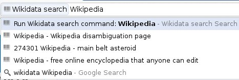
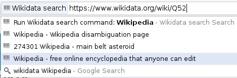

Wikidata Chrome Search
======================

[Chromium](http://www.chromium.org/) search plugin for [Wikidata](https://wikidata.org/),
the free knowledge base that anyone can edit.

You can [download it at the Chrome webstore](https://chrome.google.com/webstore/detail/wikidata-search/ingjkjibhnkhomomlmlabndfmiaejkpn)

Usage
-----

To search against Wikidata, type "wikidata" in the search bar, followed by your search terms.

Up to three results will be shown. These are indicated by a small Wikidata logo. Each result
contains the English label followed by the English description, when available. Selecting
an item allows you to preview the URL. Clicking on it or hitting enter after selecting it
takes you to the item on wikidata.org.

At this point, only English labels and descriptions for items will be searched against.

Screenshots
-----------

Possible future improvements
----------------------------

* Support for other languages
* Improve aliases or other info when there is no description
* General improvements to the search API on the Wikidata side
